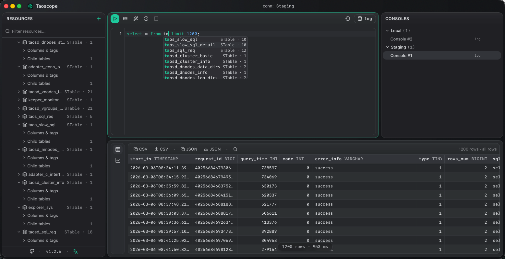
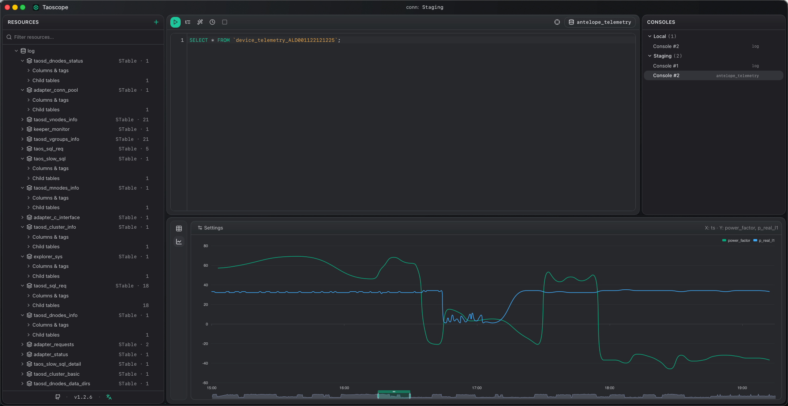

# Taoscope

**English** · [中文](README.zh-CN.md)

A fast, keyboard-friendly desktop manager for **TDengine 3.x**.

Built on Tauri 2 (Rust shell) + React 18 — a small, native binary that connects to TDengine over the REST API and gives you the productivity surfaces you'd expect from a modern SQL workbench, tuned for time-series specifics like super tables, child tables, and tags.

<p align="center">
  
</p>

<p align="center">
  
</p>

## Features

### Connections & resources

- **Multi-connection workspace** — manage many TDengine clusters side by side, online/offline indicators, per-connection refresh. **HTTP REST or native WebSocket** transport, **Basic or token** auth, optional TLS (with allow-invalid-certs escape hatch).
- **Visual table designer** — right-click in the tree to create databases / super tables / tables / child tables, edit columns & tags, or drop objects; the exact SQL is previewed live below the form before you run it.
- **Tree-style resources panel** — Connection → Database → STable / Table → inline **Columns & tags** + **Child tables**, each with a unified `⋯` / right-click action menu. Deleting a connection cascades to its consoles + saved state. Expansion state persists across reloads.
- **Double-click a sub-table** to open (or reuse) a console bound to its database and auto-append + execute `SELECT * FROM <child>;` — zero typing for a quick peek at a child table's rows.
- **Schema cache** — keystroke-driven completions don't hammer the backend.

### SQL console

- **Multiple consoles per workspace** — each bound to a connection + default DB, rename inline, kept across restarts.
- **CodeMirror editor** with a TDengine-tuned dialect (small keyword set, no MySQL bloat), syntax highlighting, line numbers, mono-spaced 13 px UI font.
- **Schema-aware autocomplete** that understands the active statement's `FROM` clause and surfaces only that table's columns + tags. Falls back silently when it can't.
- **Run modes** — selection / statement-at-cursor / full scratch, all on `⌘↵`.
- **Reads, writes & DDL** — `SELECT`, `INSERT`, `CREATE` / `ALTER` / `DROP`, `DELETE`, `SHOW`, `DESCRIBE` all run; write/DDL statements report "affected N rows" and `DROP` / `DELETE` ask for confirmation first.
- **EXPLAIN** the statement at cursor; **cancel** a long-running query; **per-connection timeout**.
- **Format**, **toggle-comment**, **copy-line-down**, history navigation — same shortcuts as JetBrains / VS Code.
- **Row cap** with one-click "show all" — large `SELECT *` queries can't accidentally fetch a million rows (injected for `SELECT` only, so other statements run verbatim).

### Results

- **Table / Chart toggle** — every result set is browsable as a virtualized grid **or** plotted as a line chart, sharing the exact same in-memory rows (no extra round-trip). Switch via the floating capsule rail that visually columns up with the editor's line-number gutter above.
- **Virtualized grid** (TanStack Table + Virtual) — millions of rows scroll smooth; per-row context menu (Copy value / row TSV / row JSON / column name) consolidated for low scroll cost.
- **Sortable / resizable columns**, per-column copy of names or values, **CSV** + **JSON** export.
- **Inline filter** across all columns.
- **Display timezone picker** in the Consoles panel header — TIMESTAMP cells, exports, and clipboard copies all render in the chosen zone (`Use system` default, `UTC`, `Asia/Shanghai`, `Asia/Tokyo`, `Asia/Kolkata`, or a custom `±HH:mm`). Sort order stays chronological regardless of display zone. **Behavior change from 1.3.x:** timestamps used to be hard-coded UTC; the new default is your local system zone — pick `UTC` from the picker to restore the old behavior.
- **Smart line chart** — X axis locks to the primary timestamp; Y candidates are auto-scored by type (FLOAT/DOUBLE preferred), value variation, non-null density, and name hints (`temp|humid|volt|count|...` boosted, `id|seq|idx` demoted) so the most-likely business metric is pre-checked. Multi-select more from the settings popover for layered series.
- **String-typed numeric columns are accepted** (TDengine BIGINT often arrives JSON-serialized as a string) — values are parsed defensively per cell so a stray non-numeric value just drops the column, never crashes the analyzer.
- **Dual Y-axis** kicks in automatically when selected series differ by >10× in magnitude (e.g. a small temperature curve alongside a BIGINT counter) — small-range metrics stay readable instead of being squashed flat.
- **Cursor-anchored time zoom** — wheel/trackpad zoom anchors on the cursor's x-position and is tuned for Mac trackpad sensitivity (echarts' default zoom factor felt runaway on multi-event swipes). The dataZoom slider at the bottom is always available too.
- **Empty state** still shows the schema headers so you know what the query would have returned.
- **Per-console history** (last 50 queries), persisted to local SQLite.

### App shell

- **Custom title bar** with native macOS traffic lights; minimize / maximize / close on Win + Linux.
- **Compact dark theme** with a Linear/Vercel-ish palette, TDengine green (`#06A77D`) as the accent; `color-scheme` pinned so native controls render identically on Light- and Dark-mode machines.
- **English / 中文** UI toggle.
- **Right-click context menus everywhere** with the same typography density.

### Auto-update

- **In-app upgrade** powered by `tauri-plugin-updater` + GitHub Releases. Silent check on startup; status-bar chip turns green `v0.2.0 · install` when something's ready.
- **ed25519-signed** payloads — the bundled public key blocks tampered updates.
- See [docs/RELEASE.md](docs/RELEASE.md) for the publisher's SOP.

## Installation

Pre-built binaries are published on the [Releases page](https://github.com/yangshan-alphaess/Taoscope/releases/latest) for every tagged version.

| Platform | Asset | First-time setup |
| --- | --- | --- |
| **macOS Apple Silicon** | `Taoscope_*_aarch64.dmg` | See [macOS Gatekeeper](#macos-gatekeeper) below |
| **macOS Intel** | `Taoscope_*_x64.dmg` | See [macOS Gatekeeper](#macos-gatekeeper) below |
| **Windows** | `Taoscope_*_x64-setup.exe` | SmartScreen → *More info* → *Run anyway* |
| **Linux .deb** | `Taoscope_*_amd64.deb` | `sudo dpkg -i Taoscope_*.deb` |
| **Linux .rpm** | `Taoscope_*.x86_64.rpm` | `sudo rpm -i Taoscope_*.rpm` |
| **Linux portable** | `Taoscope_*_amd64.AppImage` | `chmod +x` then run |

Once installed, the in-app updater takes over for every subsequent release — no need to come back to this page.

### macOS Gatekeeper

The macOS bundles aren't yet signed with an Apple Developer ID. On macOS 14 (Sonoma) and later the OS refuses unsigned apps outright with **"Taoscope.app is damaged and can't be opened"** — the old right-click → Open escape hatch no longer works.

After dragging the app into `/Applications`, run this once:

```bash
xattr -dr com.apple.quarantine /Applications/Taoscope.app
```

That strips the `com.apple.quarantine` extended attribute Gatekeeper checks for. The app launches normally afterward, and versions installed by the in-app updater don't re-trigger the warning.

## Tech stack

| Layer    | Choice |
| -------- | ------ |
| Shell    | [Tauri 2](https://tauri.app) (Rust) |
| Frontend | React 18 + Vite + TypeScript (strict) |
| UI       | [shadcn/ui](https://ui.shadcn.com) + Tailwind + Radix |
| Editor   | CodeMirror 6 + `@codemirror/lang-sql` (custom TDengine dialect) |
| Grid     | TanStack Table + TanStack Virtual |
| State    | Zustand |
| Storage  | SQLite (rusqlite) — workspace + connection records |
| Network  | reqwest over TDengine REST `/rest/sql/<db>`, or the `taos` crate over WebSocket |
| Pkg mgr  | pnpm |

## Prerequisites

- **Node** ≥ 20
- **pnpm** ≥ 9 (`npm install -g pnpm`)
- **Rust** stable via [rustup](https://rustup.rs)
- **macOS**: Xcode Command Line Tools (`xcode-select --install`)
- **Linux**: `libgtk-3-dev libwebkit2gtk-4.1-dev libayatana-appindicator3-dev librsvg2-dev libssl-dev`

Verify with `pnpm tauri info`.

## Development

```bash
pnpm install
pnpm tauri dev          # full Tauri shell (Rust + React) — recommended
pnpm dev                # frontend only, mock data source, no real TDengine
```

`pnpm dev` is fastest for UI iteration and uses the mock data source. `pnpm tauri dev` is what you want for testing real queries, the updater, or the title bar.

### Useful scripts

| Command            | What it does |
| ------------------ | ------------ |
| `pnpm tauri dev`   | Native window + Vite dev server |
| `pnpm dev`         | Vite-only with mock data source on `http://localhost:1420` |
| `pnpm build`       | `tsc` typecheck + Vite production build |
| `pnpm tauri build` | Build distributable desktop app |
| `pnpm typecheck`   | `tsc --noEmit` |
| `pnpm lint`        | ESLint over `src/` |
| `pnpm format`      | Prettier write |
| `pnpm bump <kind>` | Bump version across `package.json` + `Cargo.toml` + `tauri.conf.json`, refresh `Cargo.lock`, commit, tag `v<x.y.z>` |

## Releasing

Push a tag like `v0.2.0` → [`.github/workflows/release.yml`](.github/workflows/release.yml) builds + signs + publishes a draft GitHub Release with `latest.json` for the in-app updater. Full setup (signing-key generation, secrets, per-release checklist) is in [docs/RELEASE.md](docs/RELEASE.md).

Quick recap:

```bash
pnpm bump patch                      # 0.1.0 → 0.1.1, commits + tags
git push --follow-tags origin main   # main + tag in one shot → CI fires
```

## Project layout

```
.
├── src/
│   ├── components/
│   │   ├── console/       # editor, result grid, autocomplete, history, run logic
│   │   ├── layout/        # TitleBar, ResourcesPanel, StatusBar
│   │   ├── keyboard/      # global shortcuts
│   │   └── ui/            # shadcn primitives
│   ├── datasource/        # DataSource interface + Tauri impl + mock
│   ├── lib/               # cn(), updater store, …
│   ├── store/             # zustand stores
│   └── App.tsx
├── src-tauri/
│   ├── src/
│   │   ├── commands.rs    # Tauri command boundary
│   │   ├── datasource/    # SQLite store + http_client (REST) + ws_client (WebSocket) + shared sql_builder
│   │   └── lib.rs
│   └── tauri.conf.json
├── scripts/bump-version.mjs
├── .github/workflows/     # release.yml
└── docs/RELEASE.md
```

## Status

- **1.2.x**: read + write/DDL execution, the visual table designer, WebSocket transport, token auth, TLS, query cancel/timeout, EXPLAIN, and English/中文 UI are all in. Connection records (including secrets) live in the local SQLite workspace file — the earlier OS-keychain vault was tried and reverted (dev-mode signing friction); a blank password in the edit dialog means "keep current" so secrets never round-trip to the UI.
- Code-signing certificates are **not yet** wired up — see the [Installation](#installation) section for the one-time macOS / Windows hurdles. The in-app updater handles every subsequent upgrade cleanly.

See [FEATURES.md](FEATURES.md) for the long-tail enhancement backlog (TLS, query cancel, WS protocol, etc.).
